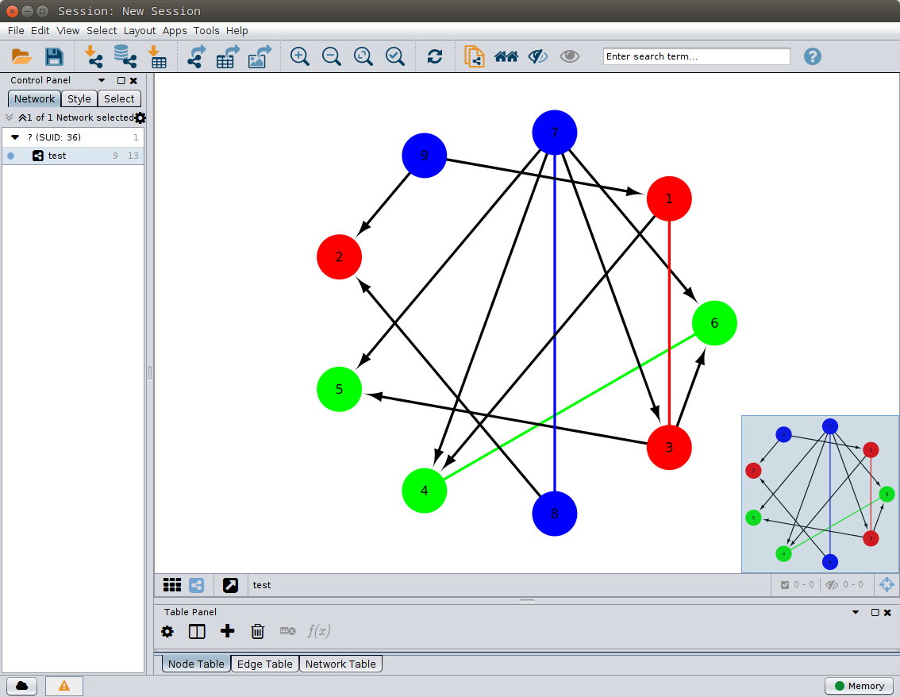

### Code:
You should open Cytoscape software session and installed CyREST extensions first.
```{r warning = F}
library(MixedGraphs)
X <- lapply(1 : 3, function(x) {
    m <- matrix(rnorm(12), nrow = 4)
    colnames(m) <- LETTERS[(3 * (x - 1) + 1) : (3 * x)]
    m
})
crf_structure = matrix(c(1, 0, 1, 1, 1, 1, 0, 0, 1), 3, 3)
brail_control <- list(B = 5, tau = 0.6)
G <- MixedGraph(X, crf_structure, brail_control = brail_control)
# plot(G, method = "Cytoscape")
```

### Graph
